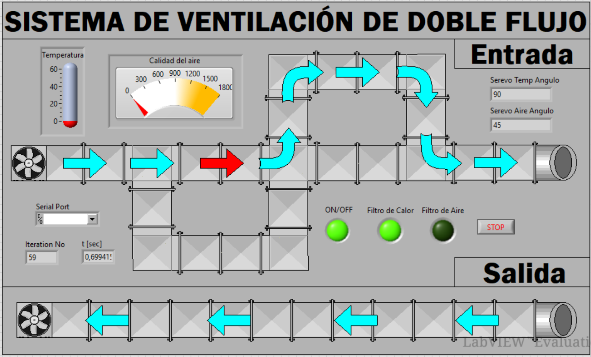

# Sistema de Ventilación de Doble Flujo

Este proyecto consiste en un sistema de control automatizado para la renovación de aire en ambientes cerrados. Fue desarrollado para la materia **Instrumentación** en la UNRN (2023).

## Concepto del Proyecto
El sistema implementa una ventilación mecánica de doble flujo que permite extraer aire viciado e introducir aire nuevo simultáneamente. Utiliza sensores de calidad de aire y temperatura para decidir de forma inteligente cuándo y cómo ventilar.

## Hardware Utilizado
- **Controlador:** Arduino UNO.
- **Sensores:** - DHT11 (Temperatura y Humedad).
  - MQ-135 (Calidad de Aire/Gases).
- **Actuadores:** - 2 Motores DC (Ventiladores de entrada y salida).
  - 2 Servomotores (Control de flaps/compuertas).
- **Etapa de Potencia:** Transistores MOSFET IRFZ44N y fuente conmutada de 12V 2A.

## Software e Interfaz (HMI)
- **LabVIEW:** Se diseñó un Panel Frontal que permite el monitoreo en tiempo real de las variables y el control manual/automático del sistema.
- **Arduino IDE:** Programación del firmware para la adquisición de datos y ejecución de comandos mediante comunicación Serial.

## Funcionalidades Clave
1. **Modo Automático:** Los ventiladores y flaps se activan según umbrales predefinidos de CO2 y temperatura.
2. **Modo Manual:** Control total desde la interfaz de LabVIEW.
3. **Monitoreo:** Visualización gráfica de la calidad del aire y estado de los actuadores.

*(Captura de la interfaz de control diseñada)*
